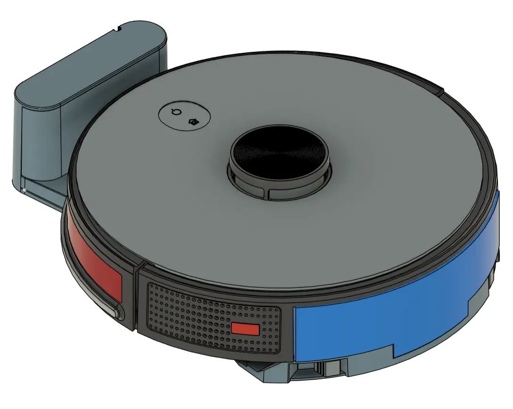
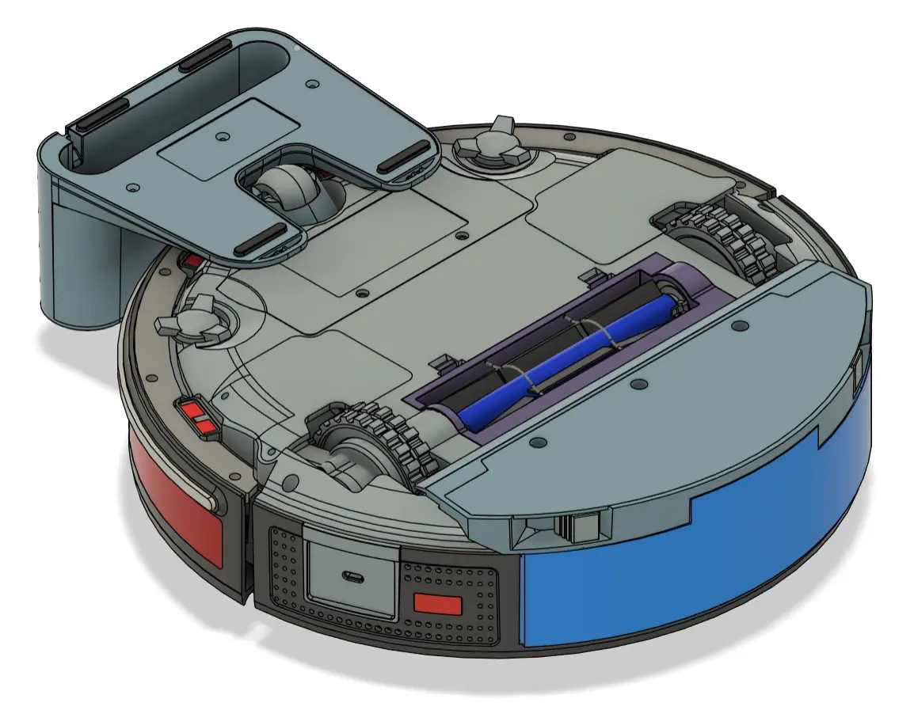
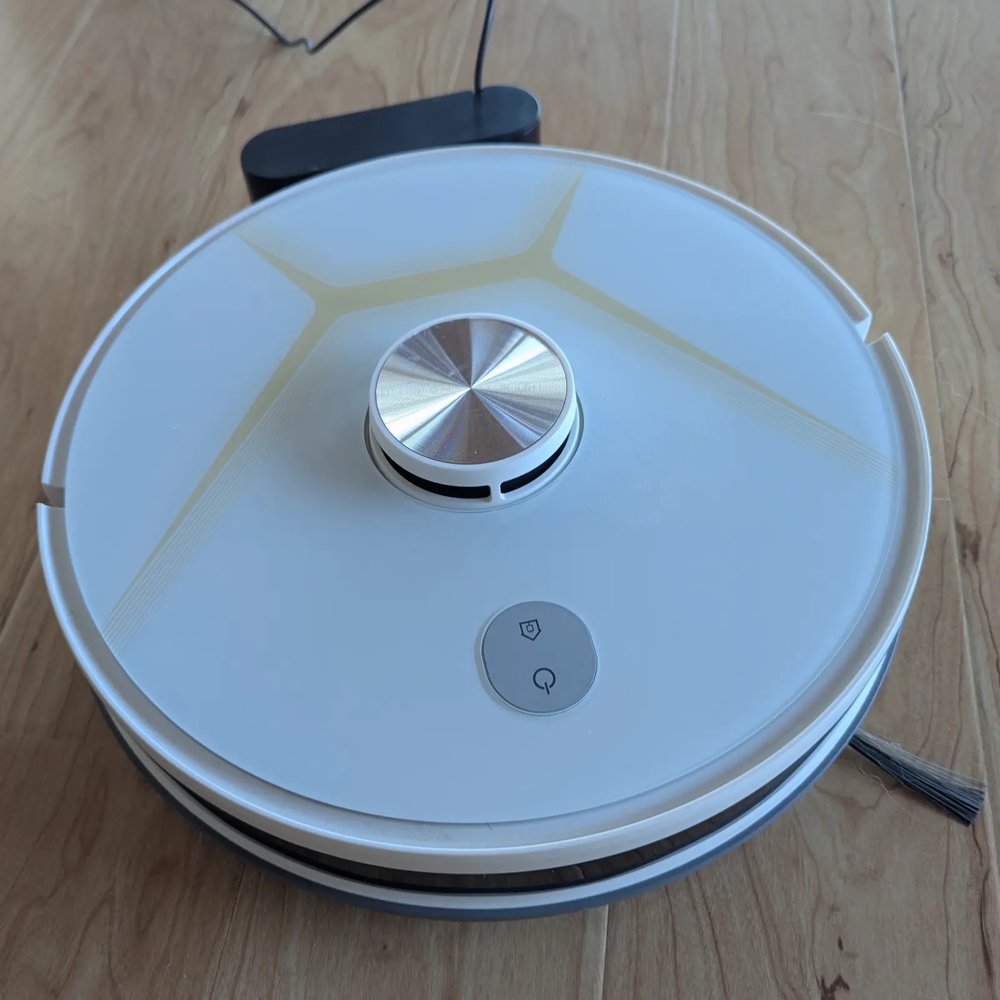

# vacuum_cleaner_teardown
A home vacuum robot cleaner teardown

## PCB

| Device | Model |
| --- | --- |
| Allwinner F1C200s | 64MB in-package RAM |
| BoyaMicro 25Q128ESS1G |  |
| Wheel motor driver | A4950T |
| Wheel motor | 365SA1887 DC 7.4V w/encoder |
| Battery | 3S 2600mAh |
| MCU | Artery AT32F403AVGT7 |
| WiFi | SV6355 2.4GHz WiFi BLE 5.0 module |
| Side brush motors | RF-500C-13430 DV 7.4V |
| Suction fan | EBO Innovation EBO-A65126 DC 8.4V 1.4A, DC 12.6V 2.2A |
| Speaker | 8 Ohm |
| Audio amp | 8002D1 |
